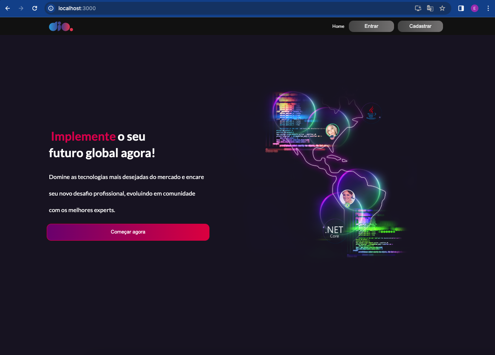
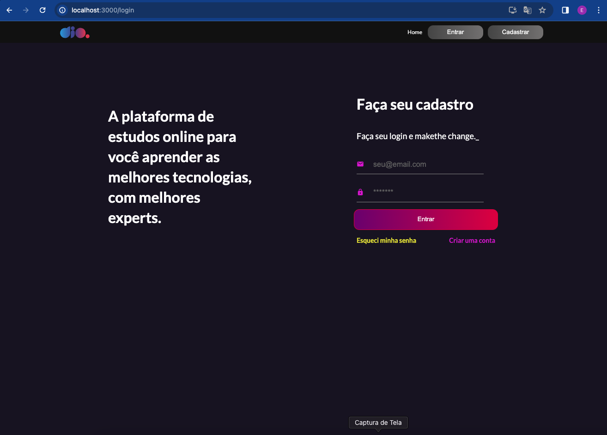
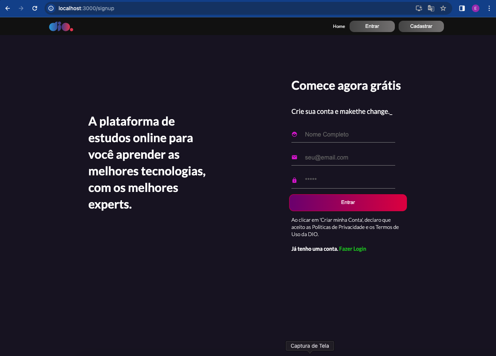

# Desafio Portal DIO.me com ReactJS e Typescript
Este projeto foi criado como parte do Desafio Portal DIO.me. É uma aplicação React que permite aos usuários visualizar e interagir com uma variedade de recursos.

### Screenshots




### Instalação
Para instalar as dependências do projeto, execute o seguinte comando:
```
npm install
```

### Execução
Para iniciar o servidor de desenvolvimento, execute o seguinte comando:
```
npm start
```

A aplicação será iniciada em http://localhost:3000.

### Funcionalidades

Componentes:
- Button
- Card
- Header
- Input
- UserInfo

Paginas
- Feed
- Home
- Login
- SignUp

### Tecnologias Utilizadas
- React
- Axios
- Styled Components
- Typescript

### Contribuição
Pull requests são bem-vindos. Para grandes alterações, por favor, abra uma issue primeiro para discutir o que você gostaria de mudar.

### Contato
Se você tiver alguma dúvida ou sugestão, sinta-se à vontade para entrar em contato.
